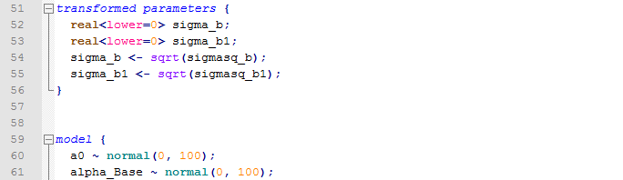

# Stan syntax for Notepad++

Add [Stan](http://mc-stan.org) syntax to [Notepad++](https://notepad-plus-plus.org/).

# Installation
1. Download [stan-udl.xml](https://github.com/martincerny/stan-notepad-plus-plus/raw/master/stan-udl.xml)
2. Save the file into the `userDefineLangs` folder in Notepad++ (can be reached via  "Language -> User defined language"). 
3. After restarting Notepad++, Stan will show under "Language" and will be associated with `.stan` files. 

# Features
* Keywords, blocks, folding
* All built-in distributions and functions as of stan 2.14.0

# Contributing
Just file a pull request at https://github.com/martincerny/stan-notepad-plus-plus/
